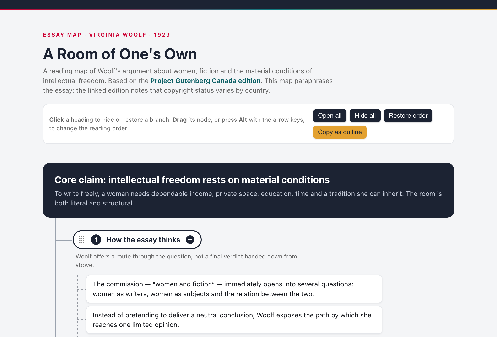

# Interactive Outline Map

An experimental agent skill for turning long documents and over-iterated ideas into self-contained interactive HTML maps you can understand, rearrange and write from.

**[Source on GitHub](https://github.com/petriaukia/interactive-outline-map)** · [the skill](https://github.com/petriaukia/interactive-outline-map/blob/main/SKILL.md) · [the template](https://github.com/petriaukia/interactive-outline-map/blob/main/assets/template.html) · MIT

[](https://petriaukia.github.io/interactive-outline-map/examples/a-room-of-ones-own.html)

*[A Room of One's Own](https://petriaukia.github.io/interactive-outline-map/examples/a-room-of-ones-own.html), mapped. Click a heading to fold a branch away, drag its node to reorder, and copy the result back out as an outline.*

## Why this exists

LLMs are good at expanding an idea, challenging it and producing one more polished iteration. After enough rounds, that fluency becomes a trap: the conversation contains so much finished-sounding prose that writing the piece yourself is suddenly harder than it was at the beginning. The easy next step is to share the model’s text. Your own voice quietly disappears from the process.

Interactive Outline Map stops one step earlier.

It turns the accumulated material into a manipulable structure of claims, evidence, tensions, examples, decisions and open questions. The result is deliberately not a finished article. It is a handoff from machine-assisted thinking back to human authorship.

The skill has two primary uses:

1. **Understand a long document.** Compress a paper, report or other source into a map that preserves its reasoning, evidence, qualifications and relationships.
2. **Recover your own writing path.** Take an idea that has been iterated with an LLM and strip away the false finality of generated prose, leaving a structure you can use to write the piece in your own style.

The interaction is deliberately limited to the first tier of an outliner: **whole branches move, individual claims do not**. The point is to get you writing, not to pull you into the minutiae of outlining. If you need to move a single claim between branches, edit the file — that is a boundary of this version, not an oversight.

## What the generated map does

- drag a branch by its dot grid to reorder it, with the mouse, a pen or by touch;
- press Alt with the arrow keys to move the focused branch from the keyboard;
- click a heading to hide or restore the branch — a hidden branch shows cards stacked behind its heading, one for a single folded leaf and two for more;
- **copy the map back out as Markdown**, in the order you left it, so the structure can leave the page;
- keep the chosen order and open/closed state between visits, until the file itself changes;
- print the complete map even when branches are hidden on screen;
- customize the visual system, and every user-visible string, through CSS variables and `data-` attributes.

Four named leaf kinds keep the distinctions the skill asks for visible: `key idea`, `from the source`, `open question` and `your words`.

## Install

The skill is a plain `SKILL.md` with an assets directory, so it works in more than one agent.

**Codex**

```sh
git clone https://github.com/petriaukia/interactive-outline-map.git ~/.codex/skills/interactive-outline-map
```

**Claude Code**

```sh
git clone https://github.com/petriaukia/interactive-outline-map.git ~/.claude/skills/interactive-outline-map
```

For a single project rather than your personal skills, clone it into `.claude/skills/` in the repository instead. Restart the agent after installing so the new skill is discovered.

## Use

In Codex, invoke it by name:

```text
$interactive-outline-map Turn this article outline into an interactive HTML map.
```

In Claude Code the skill is picked up from its description, so ask in plain language:

```text
Turn this report into an interactive outline map of its claims, evidence and open questions.
```

For writing recovery, in either tool:

```text
We have iterated this idea for too long. Reduce it to a structure I can write from in my own voice; do not draft the article.
```

The skill can also adapt an existing HTML map while preserving its content and visual style.

## Examples

All five are live at [petriaukia.github.io/interactive-outline-map](https://petriaukia.github.io/interactive-outline-map/) — the links below open the maps themselves, not their source.

1. [SWOT kartoittaa huoneen, ei markkinaa](https://petriaukia.github.io/interactive-outline-map/examples/swot-mindmap.html) is the writing-recovery case, and it is the page this skill grew out of: an argument that had been talked over until it was ready to write but not yet written, reduced to seven branches the author could write from in his own voice. Cards marked *säilytä sanasta sanaan* — keep word for word — are the only wording that is fixed; everything else is a prompt, not a sentence. It is in Finnish, so it also shows how a map is localised: `lang`, the chrome, the CSS flag names and the script's strings, all overridden without touching the CSS or the JavaScript.
2. [The outline under a 237-page report](https://petriaukia.github.io/interactive-outline-map/examples/tcf-assurance-review.html) maps a real assurance review — the Targeted Compliance Framework review written by Deloitte for an Australian government department — into the structure a writer would work from: the question asked, the method, the findings, the causes, the eight themes the whole document hangs on, the recommendations, and what the report discloses about itself. Every sourced claim carries its section number.
3. [Attention Is All You Need](https://petriaukia.github.io/interactive-outline-map/examples/attention-is-all-you-need.html) maps the 2017 Transformer paper into six movable and collapsible branches: motivation, architecture, attention, positional information, training and results. The text is a compact original summary linked to the NeurIPS publication and arXiv record; where the two report different numbers, the map follows the NeurIPS version.
4. [A Room of One's Own](https://petriaukia.github.io/interactive-outline-map/examples/a-room-of-ones-own.html) maps Virginia Woolf's 1929 essay into seven movable and collapsible branches: method, material conditions, the missing archive, literary tradition, external scrutiny, the undivided mind and the future Woolf asks readers to make. The map paraphrases the essay and links to a full-text source.
5. [A LinkedIn post about outliners](https://petriaukia.github.io/interactive-outline-map/examples/outliner-linkedin-post.html) is the map behind a LinkedIn post about this skill, made from the conversation in which the post was planned. The four cards marked *your words* are the author's own wording from that conversation, translated from Finnish; the last branch keeps what was still undecided, including whether the model's draft should be thrown away and the post written from the map instead.

The first and the last are mode 2, writing recovery; the rest are mode 1, understanding an existing text. They carry their own frozen copy of the template's CSS and script; when the template changes, they are regenerated from it rather than edited by hand.

## Checking a generated map

```sh
scripts/check.sh path/to/map.html
```

It reports the mechanical failures: leftover template text, duplicate or missing branch IDs, an unreplaced storage key, a missing `lang`, remote dependencies, more than one key idea in a branch, and a script that does not parse.

## Design

The map is a working surface, not a document: branch pills, connector lines and leaf cards are there to be grabbed, folded and read quickly. Colour is a navigation cue — a branch colour identifies the branch, and each leaf kind has its own. The default palette is the author’s own; it is a handful of CSS variables at the top of the file, and swapping them is the intended way to make a map look like yours.

## Repository status

Early and usable. The single-file template deliberately has no framework, remote dependency, analytics or build step. The current work is focused on finding the right boundary between useful synthesis and unwanted ghostwriting.

## License

[MIT](https://github.com/petriaukia/interactive-outline-map/blob/main/LICENSE)
