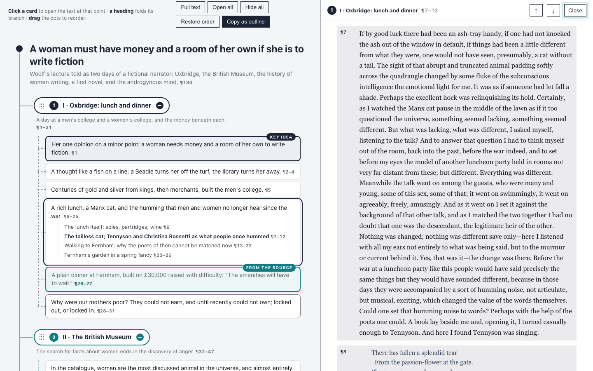

# Interactive Outline Map

An experimental agent skill for turning long documents and over-iterated ideas into self-contained interactive HTML maps you can understand, rearrange and write from.

**[Source on GitHub](https://github.com/petriaukia/interactive-outline-map)** · [the skill](https://github.com/petriaukia/interactive-outline-map/blob/main/SKILL.md) · [the template](https://github.com/petriaukia/interactive-outline-map/blob/main/assets/template.html) · MIT

[](https://petriaukia.github.io/interactive-outline-map/examples/a-room-of-ones-own.html)

*[A Room of One's Own](https://petriaukia.github.io/interactive-outline-map/examples/a-room-of-ones-own.html), mapped. Click a heading to fold a branch away, drag its node to reorder, and copy the result back out as an outline.*

## Why this exists

LLMs are good at expanding an idea, challenging it and producing one more polished iteration. After enough rounds, that fluency becomes a trap: the conversation contains so much finished-sounding prose that writing the piece yourself is suddenly harder than it was at the beginning. The easy next step is to share the model’s text. Your own voice quietly disappears from the process.

Interactive Outline Map stops one step earlier.

It turns the accumulated material into a manipulable structure of claims, evidence, tensions, examples, decisions and open questions. The result is deliberately not a finished article. It is a handoff from machine-assisted thinking back to human authorship.

The skill has two primary uses, and a third way of reading:

1. **Understand a long document.** Compress a paper, report or other source into a map that preserves its reasoning, evidence, qualifications and relationships.
2. **Recover your own writing path.** Take an idea that has been iterated with an LLM and strip away the false finality of generated prose, leaving a structure you can use to write the piece in your own style.
3. **Read the source through the map.** A *reader map* keeps the full text beside the outline. Every card opens the text at its own paragraphs, and every paragraph belongs to exactly one card, so the map is a way into the whole text rather than a substitute for it.

The interaction is deliberately limited to the first tier of an outliner: **whole branches move, individual claims do not**. The point is to get you writing, not to pull you into the minutiae of outlining. If you need to move a single claim between branches, edit the file — that is a boundary of this version, not an oversight.

## What the generated map does

- drag a branch by its dot grid to reorder it, with the mouse, a pen or by touch;
- press Alt with the arrow keys to move the focused branch from the keyboard;
- click a heading to hide or restore the branch — a hidden branch shows cards stacked behind its heading, one for a single folded leaf and two for more;
- **copy the map back out as Markdown**, in the order you left it, so the structure can leave the page;
- keep the chosen order and open/closed state between visits, until the file itself changes;
- print the complete map even when branches are hidden on screen;
- customize the visual system, and every user-visible string, through CSS variables and `data-` attributes.

Four named leaf kinds keep the distinctions the skill asks for visible: `key idea`, `from the source`, `open question` and `your words`.

## Reader maps: the full text beside the map

A summary map tells you what a text says. A reader map also takes you there. It is for the moment when the outline has made you curious and you want to check the source itself: what exactly Woolf wrote about the looking-glass, or how Simon argued that people will still have jobs.

[](https://petriaukia.github.io/interactive-outline-map/examples/a-room-of-ones-own-reader.html)

*[A Room of One's Own, as a reader map](https://petriaukia.github.io/interactive-outline-map/examples/a-room-of-ones-own-reader.html). The card on the left opened the text on the right.*

What it adds to an ordinary map:

- **every card is a way in.** Each card and sub-point carries a locator such as `¶7–12`; clicking it opens the text pane at those paragraphs and tints them;
- **the map covers the text exactly once.** The build refuses to write the page unless every paragraph, verse and long quotation included, belongs to one card, so nothing in the source is out of the map's reach;
- **the two follow each other.** Scrolling the text marks the card you are in; clicking a paragraph number in the text takes you back to its card; the arrows step card by card in the order you have dragged the branches into;
- **a link points at a place.** The address changes to `#p54` as you go, so a link opens the text at the same paragraph.

**Use it on a laptop-width screen or wider.** At about 1,180 pixels and up, the map and the text sit side by side, and that is where the back-and-forth works best. On a phone the text opens over the map, one at a time: everything still works, but you lose the view of both together, which is the point.

Reader maps are built with the scripts in [`scripts/reader/`](https://github.com/petriaukia/interactive-outline-map/tree/main/scripts/reader): a splitter turns a PDF (`pdf_paragraphs.py`) or an HTML edition (`html_paragraphs.py`) into numbered paragraphs, you write the outline as a small spec with a paragraph range on every card, and `build_reader.py` assembles the page from the same template as every other map. The page embeds the whole source, so build a public one only from a text you may redistribute. For anything else, `--outline-only` builds the same map without the text, with locators that name the source's own section headings instead.

## Install

The skill is a plain `SKILL.md` with an assets directory, so it works in more than one agent.

**Codex**

```sh
git clone https://github.com/petriaukia/interactive-outline-map.git ~/.codex/skills/interactive-outline-map
```

**Claude Code**

```sh
git clone https://github.com/petriaukia/interactive-outline-map.git ~/.claude/skills/interactive-outline-map
```

For a single project rather than your personal skills, clone it into `.claude/skills/` in the repository instead. Restart the agent after installing so the new skill is discovered.

## Use

In Codex, invoke it by name:

```text
$interactive-outline-map Turn this article outline into an interactive HTML map.
```

In Claude Code the skill is picked up from its description, so ask in plain language:

```text
Turn this report into an interactive outline map of its claims, evidence and open questions.
```

For a reader map:

```text
Make a reader map of this PDF: an outline whose every card opens the full text at the right place, covering the whole document.
```

For writing recovery, in either tool:

```text
We have iterated this idea for too long. Reduce it to a structure I can write from in my own voice; do not draft the article.
```

The skill can also adapt an existing HTML map while preserving its content and visual style.

## Examples

All seven are live at [petriaukia.github.io/interactive-outline-map](https://petriaukia.github.io/interactive-outline-map/) — the links below open the maps themselves, not their source.

1. [SWOT maps the room, not the market](https://petriaukia.github.io/interactive-outline-map/examples/swot-mindmap.html) is the writing-recovery case, and it is the page this skill grew out of: an argument that had been talked over until it was ready to write but not yet written, reduced to seven branches the author could write from in his own voice. Cards marked *your words* are the only wording that is fixed; everything else is a prompt, not a sentence. The map was made in Finnish and is shown here in translation.
2. [Finland's Artificial Intelligence Programme, final report](https://petriaukia.github.io/interactive-outline-map/examples/finland-ai-programme-2019.html) maps the 133-page final report of Finland's national AI programme, published by the Ministry of Economic Affairs and Employment in 2019, with its case studies, background and repetition taken out. What remains is the report's distinct claims, its 46 recommendations grouped by key action, and what it offers in place of measurable objectives. Each recommendation is marked with the owner or deadline it names; unmarked ones name neither. Every claim carries its page number.
3. [Attention Is All You Need](https://petriaukia.github.io/interactive-outline-map/examples/attention-is-all-you-need.html) maps the 2017 Transformer paper into six movable and collapsible branches: motivation, architecture, attention, positional information, training and results. The text is a compact original summary linked to the NeurIPS publication and arXiv record; where the two report different numbers, the map follows the NeurIPS version.
4. [A Room of One's Own](https://petriaukia.github.io/interactive-outline-map/examples/a-room-of-ones-own.html) maps Virginia Woolf's 1929 essay into seven movable and collapsible branches: method, material conditions, the missing archive, literary tradition, external scrutiny, the undivided mind and the future Woolf asks readers to make. The map paraphrases the essay and links to a full-text source.
5. [A Room of One's Own, as a reader map](https://petriaukia.github.io/interactive-outline-map/examples/a-room-of-ones-own-reader.html) is the same essay with the full text beside the map. Its seven branches follow the chapters, because a reader map's branches must each cover one unbroken run of text; the thematic map above groups the ideas instead. All 143 paragraphs, the verse Woolf quotes and her 13 footnotes are reachable from the map, each from exactly one card. The text is the Hogarth Press edition from Project Gutenberg Canada; the essay is in the public domain in the EU, the UK and the US. Best on a laptop-width screen.
6. [The Corporation: Will It Be Managed by Machines?](https://petriaukia.github.io/interactive-outline-map/examples/simon-the-corporation-1960.html) maps Herbert Simon's 1960 forecast of management in 1985, built by the reader-map scripts with `--outline-only`. The chapter is not ours to redistribute, so the page carries no text: each card names the section of Simon's chapter it covers instead, and the cards still cover every paragraph exactly once.
7. [A LinkedIn post about outliners](https://petriaukia.github.io/interactive-outline-map/examples/outliner-linkedin-post.html) is the map behind a LinkedIn post about this skill, made from the conversation in which the post was planned. The four cards marked *your words* are the author's own wording from that conversation, translated from Finnish; the last branch keeps what was still undecided, including whether the model's draft should be thrown away and the post written from the map instead.

The first and the last are mode 2, writing recovery; the rest are mode 1, understanding an existing text, and the fifth is the one reader map. They carry their own frozen copy of the template's CSS and script; when the template changes, they are regenerated from it rather than edited by hand.

## Checking a generated map

```sh
scripts/check.sh path/to/map.html
```

It reports the mechanical failures: leftover template text, duplicate or missing branch IDs, an unreplaced storage key, a missing `lang`, remote dependencies, more than one key idea in a branch, and a script that does not parse. A reader map's coverage is checked earlier, by `build_reader.py`, which will not write a page whose cards miss or double-count a paragraph.

## Design

The map is a working surface, not a document: branch pills, connector lines and leaf cards are there to be grabbed, folded and read quickly. Colour is a navigation cue — a branch colour identifies the branch, and each leaf kind has its own. The default palette is the author’s own; it is a handful of CSS variables at the top of the file, and swapping them is the intended way to make a map look like yours.

## Repository status

Early and usable. The single-file template deliberately has no framework, remote dependency, analytics or build step. The current work is focused on finding the right boundary between useful synthesis and unwanted ghostwriting.

## License

[MIT](https://github.com/petriaukia/interactive-outline-map/blob/main/LICENSE)
